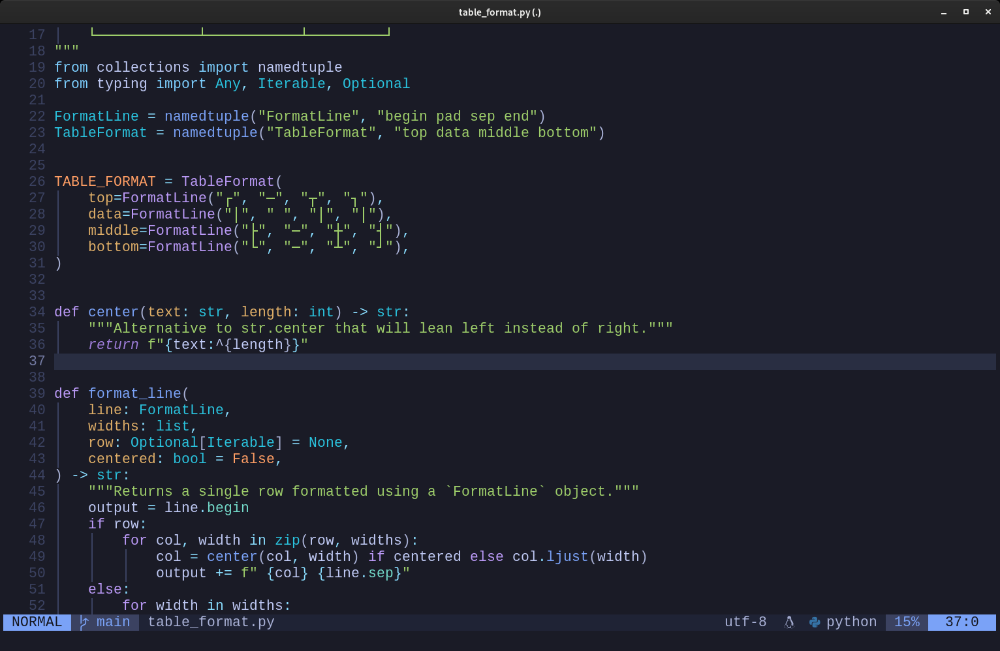

# /docs/neovim.md

My personalized code editor (Neovim) configuration.

[Go back to README](../README.md)

## What's special about it?

The configuration is using the latest features of Neovim, with plugins fully modernized for the 21st century.

Some highlights of what's being used:
- [Language Server Proctocol (LSP)](https://en.wikipedia.org/wiki/Language_Server_Protocol) integrations for language features like auto complete, go-to definition, find all references, etc.
- [nvim-treesitter](https://github.com/nvim-treesitter/nvim-treesitter) for syntax highlighting through Treesitter language parsers.

## Source code

Main configuration: [packages/neovim/config](../packages/neovim/config)
