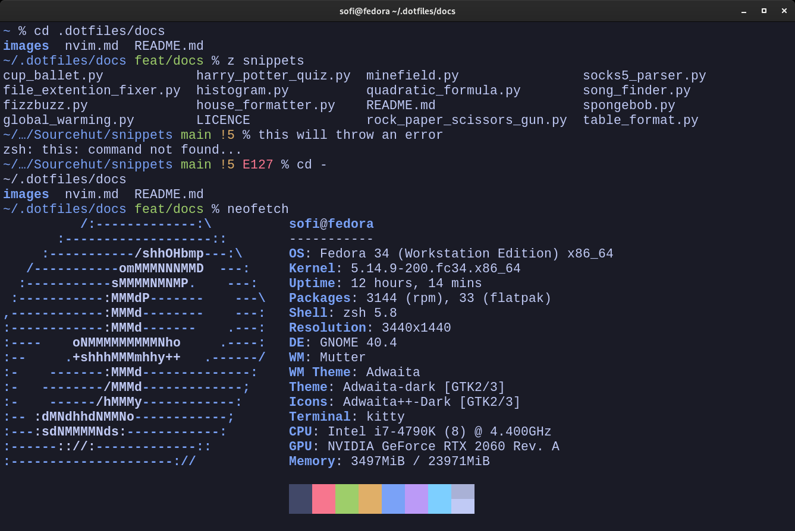

# /docs/zsh.md

My personalized shell (zsh) configuration.

[Go back to README](../README.md)

## What's special about it?

- A by needs basis prompt. Only showing errors, git branch, git status, virtualenvs only when required. Advanced and without the clutter of more conventional prompts.
- A unique directory print system, where it will intelligently show the last two folders when in deeply nested folder structures. For example `~/…/Sourcehut/snippets` and `/usr/…/share/applications`.
- [zoxide](https://github.com/ajeetdsouza/zoxide), allowing for dynamic intelligent search of commonly used directories. `z Do` for the `~/Downloads/` folder, or something more advanced like `z appli` to parse out to `/usr/local/share/applications/`.
- [Fzf](https://github.com/junegunn/fzf), a fuzzy finder for command history. Access it with `CTRL+R`.

## Source code

Main configuration: [home/zsh](../home/zsh)
